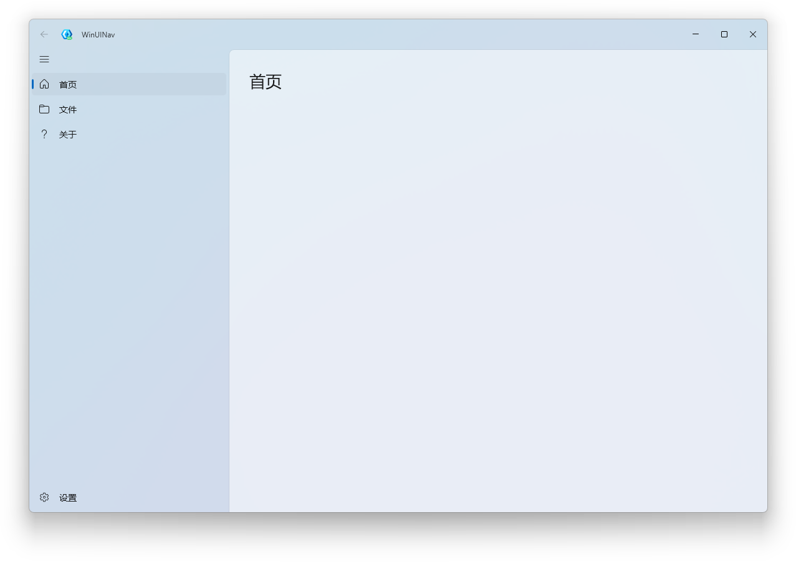
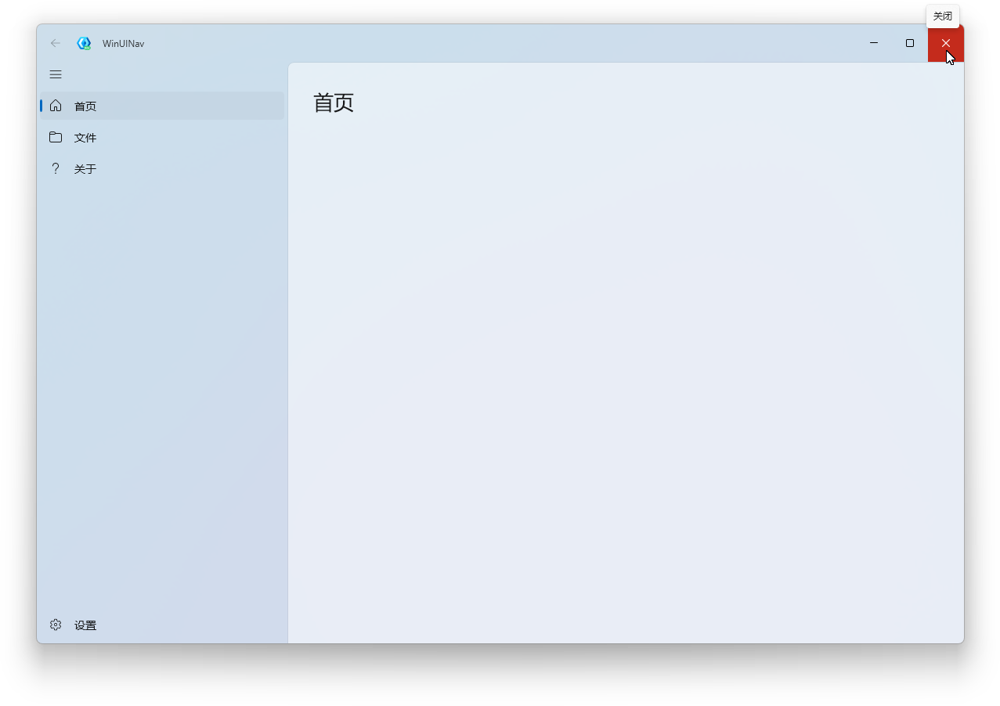
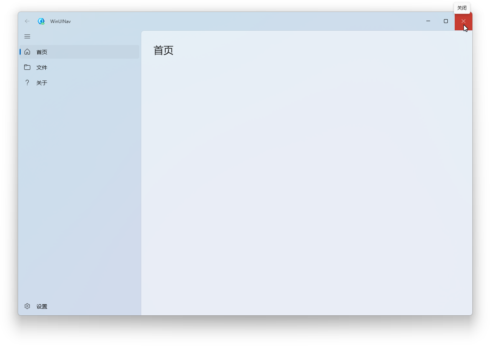
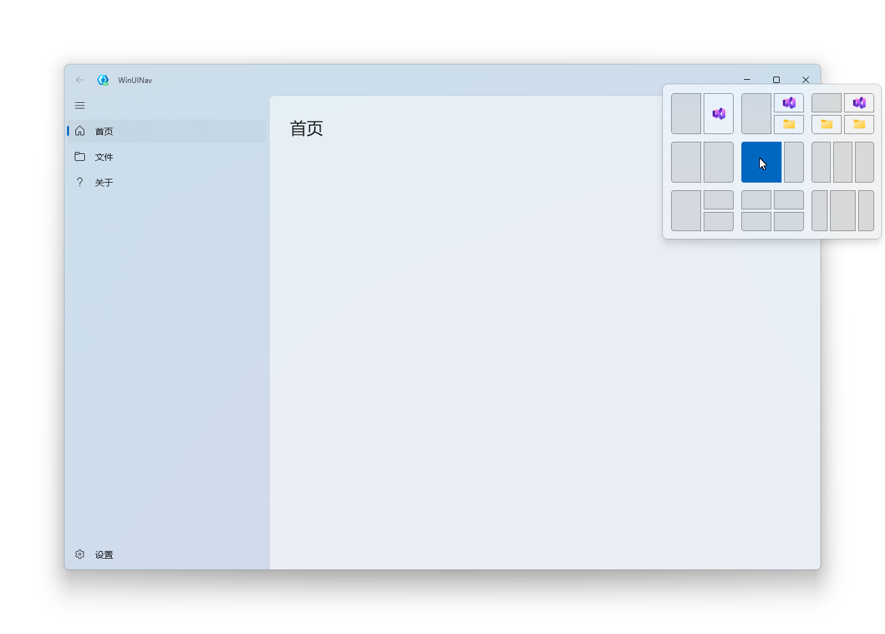

# WinUINav

<p align="center">
  一个面向 Windows 桌面应用的导航式程序模板，重点优化窗口观感、系统交互与基础界面一致性。
</p>

<p align="center">
  
  
  
  <a href="https://t.me/WinUINavGroup">
    
  </a>
  <a href="https://t.me/WinUINav">
    
  </a>
</p>

---

## 简介

WinUINav 是一个可直接作为项目起点使用的桌面应用模板。

它并不只提供基础页面与导航结构，而是优先处理实际开发中最常见、也最影响成品观感的窗口层问题，包括标题栏按钮表现、系统布局交互、窗口边缘显示一致性，以及底层背景质感等内容。  
对于希望构建更接近 Windows 11 原生体验的应用项目，这个模板可以减少前期在基础界面层面的重复调整成本。

---

## 核心特性

- **标题栏按钮采用 Windows 11 原生颜色逻辑**  
  改善默认按钮状态在视觉表现上的偏差，使窗口控制区更接近系统原生应用的观感。

- **支持 Snap Layout**  
  保留 Windows 11 下常用的窗口布局交互能力，在多窗口使用场景中具备更完整的系统体验。

- **修复窗口内外层不同步导致的露白边问题**  
  在缩放、拖动及窗口状态切换过程中，边缘显示更完整，减少突兀的白边与层级割裂感。

- **窗口最底层根背景替换为 Mica Alt**  
  优化底层背景表现，使整体视觉质感更统一，更符合 Windows 11 的桌面风格。

- **可直接作为实际项目模板使用**  
  不需要从空白模板开始处理基础外观问题，适合直接扩展为正式应用。

---

### 主界面



### 窗口效果







---

## 适用场景

WinUINav 适合作为以下类型项目的起始模板：

- 采用导航式布局的桌面应用
- 工具类、管理类、设置类程序
- 对窗口外观完整性有较高要求的项目
- 希望从项目初期即具备较成熟基础界面的应用开发

---

## 快速开始

### 环境要求

- Windows 11 24H2 及以上（推荐 25H2）
- Visual Studio 2026

### 使用方式

1. 克隆仓库

   ```bash
   git clone https://github.com/BitCloudStudio/WinUINav.git
